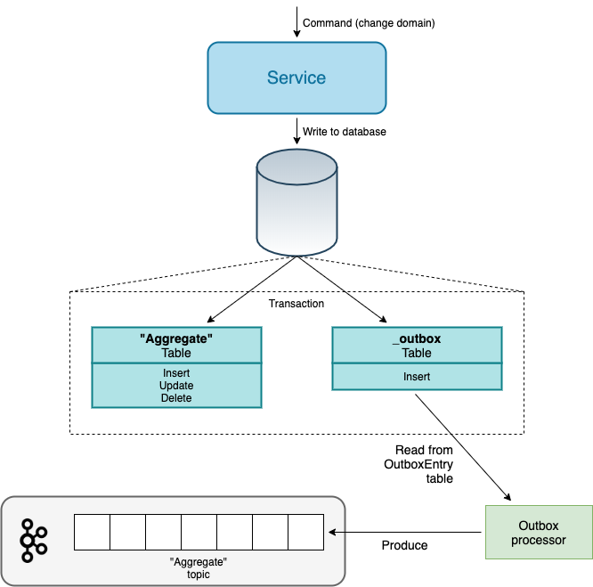

# Outbox

This documentation will not dive into the pros/cons of the Outbox pattern, but merely offer Dafda's take on it.

!!! info "The Outbox Pattern"
    For more information, see e.g. https://microservices.io/patterns/data/transactional-outbox.html

## Dafda Outbox Implementation

Dafda offers a _framework_ for implementing a custom Outbox, using whatever technology is required, as longs as a few key interfaces are implemented and configured. Whether dispatching of outbox message are handled in-process or out-of-band is entirely up to the Dafda client.

Below is a diagram over the moving parts:

The _Service_, e.g. an ASP.NET application, receives a command request that writes data to the domain model (the _"Aggregate"_) in the relational database. Supplying a custom implementation of the `IOutboxEntryRepository` interface, outbox messages should be persisted as part of the same _transaction_ as the domain model. The _Outbox processor_ will (either by notifications or timeouts) process the "unpublished" outbox messages, and produce those on the _"Aggregate"_ Kafka topic.

## Example

For a comprehensive example using ASP.NET Core, EF Core, and Postgres to persist outbox message, including an out-of-band outbox processor, take a look at the [OutOfBandOutboxMessaging](https://github.com/dfds/dafda/blob/master/examples/Academia/OutOfBandOutboxMessaging.cs) for the required configuration, and [outbox_ddl.sql](https://github.com/dfds/dafda/blob/master/db/migrations/outbox_ddl.sql) for the Postgresql schema.
